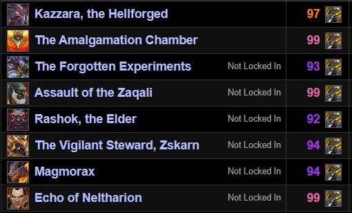
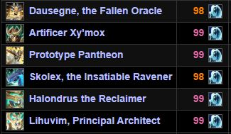

# Worldy Rotation

WorldyRotation is World of Warcraft addon to execute the best possible DPS rotation in every PvE situation at max level.
It is based on [HeroRotation](https://github.com/herotc/hero-rotation) and it's powerful [HeroLib](https://github.com/herotc/hero-lib).

Feel free to join our [Discord](https://discord.gg/GTkJm8qZrm).

Quality Feedback & Rotation Developers are highly appreciated!

## Features

- NO Lua Unlocker required.
- Pixel based key simulations.
- Rotations based on simc profiles.
- Easily extensible and complete lua developer experience.

## Supported Rotations

| Class        | Specs                                                                                        |                                                                                              |                                                                                    |                                                                               |
| :----------- |:---------------------------------------------------------------------------------------------|:---------------------------------------------------------------------------------------------|:-----------------------------------------------------------------------------------|-------------------------------------------------------------------------------|
| Death Knight |                                     |                             |                         |                                                                               |
| Demon Hunter |                             |                     |                                                                                    |                                                                               |
| Druid        |                         |                             |                     |  |
| Evoker       |                 |               |                                                                                    |                                                                               |
| Hunter       |           |               |             |                                                                               |
| Mage         |                                   |                                       |                   |                                                                               |
| Monk         |                   |                           |                 |                                                                               |
| Paladin      |                   |                 |                     |                                                                               |
| Priest       |                                   |                           |                             |                                                                               |
| Rogue        |                     |                           |             |                                                                               |
| Shaman       |                             |                 |               |                                                                               |
| Warlock      |                   |                   |       |                                                                               |
| Warrior      |                               |                               |         |                                                                               |

 - The rotation does have an optimal SimC APL and is optimally implemented in the addon.\
 - The rotation is not supported on SimC or is not yet implemented in the addon.

## Logs

